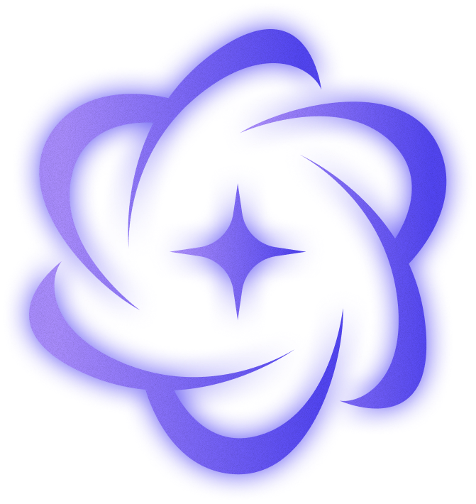

# World Industries Network (WIN)

  

  **Connecting Entrepreneurs, One Opportunity at a Time**

  
  
  
  

---

## What is WIN?

World Industries Network (WIN) is a global B2B social media platform that connects entrepreneurs, manufacturers, and businesses to discover opportunities, build partnerships, and scale sustainably in the massive B2B commerce market.

It's built for the post-AI era: In-house AI assistants like Jarv1s and D0nna provide predictive insights and automate most operations in the booming AI industry, blockchain handles secure, low-fee transactions in the expanding blockchain sector, and ESG scoring rewards ethical practices as investors focus on climate resilience and biodiversity in current trends.

---

## What We Offer

### AI Tools
- **D0nna** - Your sharp assistant that handles scheduling, reminders, and task organization without the hassle.
- **Jarv1s** - Delivers precise business analytics, strategic insights, and predictive guidance to sharpen your decisions.
- **Curiosity** - Scans global markets in real time to spot trends, supply gaps, and regulatory shifts before competitors do.
- **ESG Scoring** - Computes your ESG score and provides straightforward advice on boosting ethical standards to draw in better partners.

### Networking
- **Feed** - Events that connect you with people who matter to your business
- **Threads** - Live sessions for real collaboration
- **Meets (private)** - Events designed to link you directly with key players who can advance your business goals. D0nna moderates, Jarv1s provides translation/analytics.
- **Reseautage | Co-Development Circles** - Team up with industry peers on tangible projects, sharing expertise and driving mutual progress.
- **Links** - AI-driven connections that pair you with the most effective suppliers, partners, or customers your operation demands in the 0asis, via Jarv1s analytics.
- **Hooks** - Carousel of short videos for quick promotions or shares, with easy creation tools and scheduling via D0nna.

### Funding
- **$WIN Token** - Secure, low-fee transactions powered by Solana blockchain for efficient global dealings.
- **Pulse** - Pitch your ideas straight to the community for crowdfunding, bypassing traditional gatekeepers.
- **0asis** - A robust marketplace where you trade services, products, and partnerships seamlessly.
- **Multiple Payment Options** - Handle transactions via crypto, cards, or whatever fits your workflow.

### Business Tools
- **Smart Organisational Calendar** - AI-optimized scheduling that nails efficiency.
- **Payment Processing** - Accept transactions with minimal fees. Keeping things fast and low-cost.
- **Analytics Dashboard** - Cuts through noise to deliver actionable insights on performance and trends.
- **ESG Tracking** - Monitors your sustainability efforts and offers clear paths to improvement.

---

## Who This Is For

- **Entrepreneurs** hunting genuine opportunities and solid connections to scale their ventures.
- **Manufacturers** needing reliable suppliers or eager to snag new clients without the runaround.
- **Startups** craving real funding and hands-on mentorship to launch and grow.
- **Freelancers and consultants** seeking projects
- **Anyone tired of LinkedIn's** static profiles and endless paywalls blocking progress & efficiency.

---

## Why We're Different

Most platforms just hook you up with contacts. WIN plugs you straight into actual opportunities that move the needle.

- AI hunts down opportunities for you—no more wasting time on manual searches.
- Funding's baked in—pitch and raise capital right on the platform, forget chasing external investors.
- ESG scoring gets crunched by AI from real data, not biased self-reported hype.
- Fees boil down to mere cents instead of gouging percentages, all thanks to blockchain efficiency.
- Everything's consolidated in one spot—no app-hopping required.

---

## Documentation

1. **[README.md](README.md)** - Start here for an overview
2. **[VISION.md](VISION.md)** - Our mission and values
3. **[FEATURES.md](FEATURES.md)** - What WIN offers
4. **[TECHNOLOGY.md](TECHNOLOGY.md)** - How we build it
6. **[TOKENOMICS.md](TOKENOMICS.md)** - $WIN token economics
7. **[ROADMAP.md](ROADMAP.md)** - Development timeline
8. **[FAQ.md](FAQ.md)** - Common questions

---

## For Different Audiences

**Users:** Read README → FEATURES → FAQ

**Investors:** Read README → VISION → TOKENOMICS → ROADMAP

**Developers:** Read TECHNOLOGY → FEATURES → ROADMAP

**Partners:** Read README → VISION → ROADMAP

**Press:** Read README → VISION → ROADMAP

---

## Quick Links

**- Website:** https://www.worldindustriesnetwork.com/

**- Twitter:** https://x.com/WINofficials

**- Instagram:** https://www.instagram.com/worldindustriesnetwork

**- Discord:** https://discord.gg/scYjRwvnn9

---

## License

**Copyright © 2025-2026 World Industries Network. All rights reserved.**